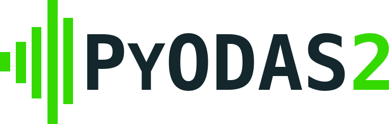
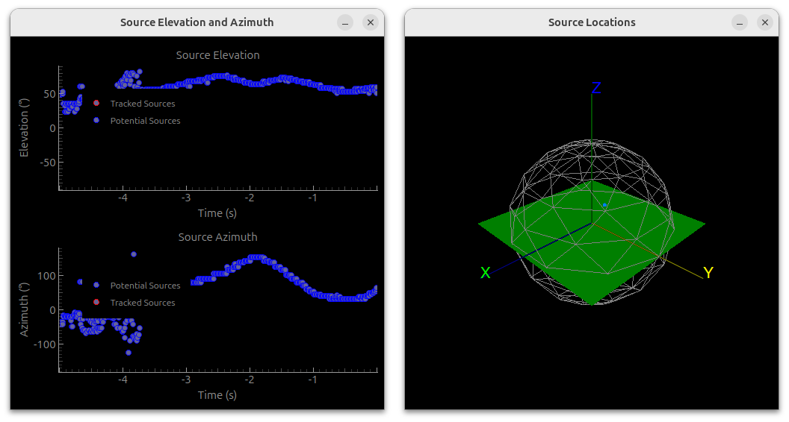
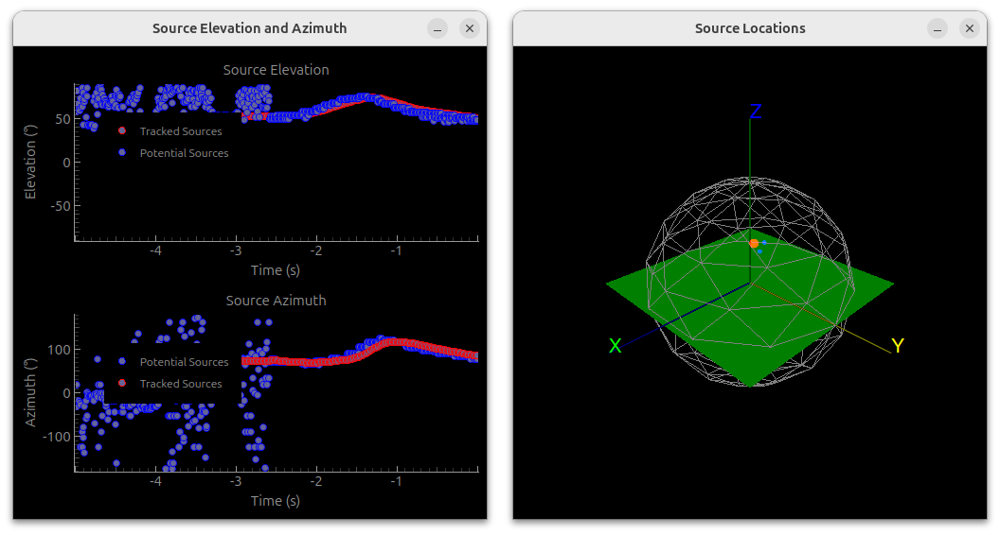

PyODAS2 Documentation
######################

**PyODAS2** is an advanced Python library designed for embedded audio processing applications. This package contains
Python bindings for `ODAS2 <https://github.com/FrancoisGrondin/odas2>`_. Its primary focus is to enable developers and
researchers to achieve sound source localization, tracking, separation, and acoustic imaging with ease and efficiency.
The library is built with simplicity, flexibility, and scalability in mind, making it a versatile tool for a wide range
of real-world audio processing tasks.

Overview
*********

Modern systems in robotics, surveillance, and audio applications increasingly rely on sound for interaction and
functionality. PyODAS2 bridges the gap between theoretical sound processing techniques and practical implementation,
offering a ready-to-use, open-source framework for audio-based systems.

By using PyODAS2, you can:

* Pinpoint the location of sound sources in 3D space.

* Dynamically track moving audio sources over time.

* Separate individual audio signals from a mix for clarity and analysis.

* Visualize sound fields with acoustic images.

PyODAS2 is designed to work seamlessly on embedded systems, ensuring low latency and high performance even in
constrained environments.

Platform Compatibility
***********************
* **Pre-recorded Audio Processing**: PyODAS2 supports all major platforms, including Windows, Linux, and macOS,
  for processing audio files.

* **Live Audio Processing**: Real-time processing of live audio streams is currently supported only on Linux due to the
  usage of PyAlsaAudio.

Make sure to check the platform requirements for your use case to ensure a smooth experience.

Task Descriptions
******************

Sound Source Localization (SSL)
================================
**Sound Source Localization (SSL)** is a process used to determine the direction of a sound source in space based on
audio signals captured by many microphones. It involves analyzing the acoustic signals to estimate the direction from
which the sound is originating. SSL is a fundamental technique in various fields such as robotics, audio engineering,
surveillance, and human-computer interaction.

Sound Source Tracking (SST)
============================
**Sound Source Tracking (SST)** is the process of continuously monitoring and estimating the direction of one or more
sound sources as they move through an environment. It extends Sound Source Localization (SSL) by adding a temporal
dimension, allowing systems to dynamically follow the trajectory of sound sources over time.

Sound Source Separation (SSS)
==============================
**Sound Source Separation (SSS)** is the process of isolating individual sound sources from a mixture of overlapping
audio signals. The goal is to separate each source into distinct components, enabling independent analysis, enhancement,
or manipulation of the audio signals.

SSS is essential in situations where multiple sound sources coexist, such as a crowded room or a surveillance scenario
with overlapping conversations.

TODO image or video

Acoustic Imaging
=======================
**Acoustic imaging** is the process of creating a spatial representation of sound sources within an environment by
visualizing the distribution and location of acoustic energy. It involves using specialized sensors and algorithms to
map sound intensity or direction onto a visual display, similar to how cameras capture light to create visual images.

This technology is often used in fields like acoustics, robotics, surveillance, and industrial diagnostics to understand
and analyze the spatial properties of sound in real-world environments.

TODO image or video

Getting Started
****************

Installation
=============

* 64-bits Raspberry Pi Computers:

.. code-block:: bash

    sudo apt install libcap-dev python3-libcamera python3-picamera2
    python3 -m venv --system-site-packages venv
    source venv/bin/activate
    pip install pyodas2

* Other Computers:

.. code-block:: bash

    python -m venv venv
    source venv/bin/activate
    pip install pyodas2

Tutorials
==========

Comprehensive :doc:`tutorials <tutorials/index>` are available to guide you through the features and functionalities of
PyODAS2.

API Documentation
==================

A comprehensive :doc:`API documentation <api/index>` is available to guide you through the advanced features and
functionalities of PyODAS2.

License
****************
This project is licensed under the MIT License. You’re free to use, modify, and distribute PyODAS2 in your projects
with attribution.

.. toctree::
   :maxdepth: 3
   :hidden:
   :caption: Contents:

   tutorials/index
   api/index

Authors
********
* Marc-Antoine Maheux
