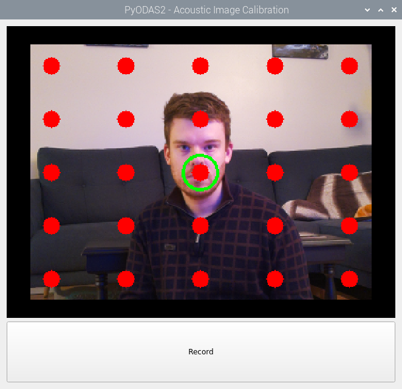
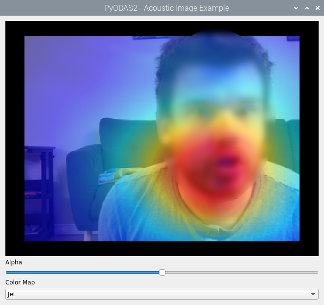

7. Acoustic Imaging
####################

This tutorial demonstrates how to generate acoustic images in real time using the PyODAS2 library.
Acoustic imaging is the process of creating a spatial representation of sound sources within an environment by
visualizing the distribution and location of acoustic energy. Here's how it works in PyODAS2:

1. **Calibration Phase.** Before generating an acoustic image, the system must be calibrated to correctly map time
   delays (TDOAs - Time Difference of Arrivals) to image pixels. This involves:

* **Providing TDOAs and Pixel Coordinate Matching:** A set of known TDOAs is associated with specific pixel coordinates
  in the image. These reference points help define how sound travels through the environment.

* **Interpolating TDOAs for Each Pixel:** Since the initial TDOA measurements are discrete, interpolation is used to
  estimate the TDOAs for every pixel in the image. This ensures a smooth and accurate representation of the sound field.

* **Computing Projection Matrices:** Projection matrices are calculated to map sound energy onto the image. These
  matrices use the interpolated TDOAs to determine how each microphone’s signal contributes to different parts of the
  image, essentially projecting the sound sources onto a 2D representation.

2. **Generation Phase.** Once calibration is complete, the system can process live or recorded sound data to generate an
   acoustic image in real-time. This involves:

* **Applying Projection Matrices to Compute Sound Energy:** The precomputed projection matrices are used to calculate
  the sound energy at each pixel. This step effectively reconstructs the spatial distribution of sound sources.

* **Normalizing the Energy for Display:** Since raw sound energy values may vary significantly, normalization is applied
  to scale the values for better visualization. This ensures that the acoustic image accurately highlights dominant
  sound sources without being overwhelmed by variations in intensity.

For more details, you may read the following paper: `Audio-Visual Calibration with Polynomial Regression for 2-D
Projection Using SVD-PHAT <https://arxiv.org/pdf/2002.01440>`_.

To create acoustic images, a camera must be positioned at the center of the microphone array.
For the SC-16 and SC-16F, STL models are available to be printed for holding a Raspberry Pi Camera 3.
TODO link

A. Calibration
***************

The following script allows you to perform acoustic image calibration. If you want to use a Pi Camera instead of a
OpenCV Camera, you can replace :code:`CvCamera` by :code:`PiCamera`.

.. include:: ../../../examples/live/acoustic_image_calibration.py
   :literal:

* The video thread captures the images and displays them on the calibration widget.

* The audio thread initializes the sound card before processing the audio. When the record button is clicked, it
  registers the current TDOAs for the current target. Once all TDOAs are recorded, the calibration process begins.

* The main function initializes the acoustic image calibration pipeline, the widget and the threads before executing the
  graphical interface.

After running the script, the following window appears. The current target is indicated by a green circle, and a button
at the bottom allows you to record the current TDOAs.

Follow this procedure to perform the calibration:

1. Position your mouth at the current target location.

2. Produce a fricative sound for at least 10 seconds.

3. While making the fricative sound, click the record button.

4. Repeat the steps for the next target.

Once all targets are recorded, the calibration process begins, which may take several hours. The calibration can be
adjusted using the arguments of :code:`AcousticImageCalibrationPipeline`. For more information, you can consult
:py:class:`pyodas2.pipelines.AcousticImageCalibrationPipeline`.

B. Acoustic Image Generation
*****************************

Once the calibration is done, the following script allows you to perform acoustic image generation. If you want to use
a Pi Camera instead of a OpenCV Camera, you can replace :code:`CvCamera` by :code:`PiCamera`.

.. include:: ../../../examples/live/acoustic_image_example.py
   :literal:

* The video thread captures the images, generate acoustic images and displays them on the calibration widget.

* The audio thread initializes the sound card before processing the audio.

* The main function initializes the acoustic image pipeline, the widget and the threads before executing the graphical
  interface.

After running the script, the following window appears. You can adjust the color map of the acoustic image and modify
its opacity.

Summary
********

Running these scripts allows you to integrate a camera and microphone array to generate real-time acoustic images,
providing a practical demonstration of PyODAS2's capabilities.
